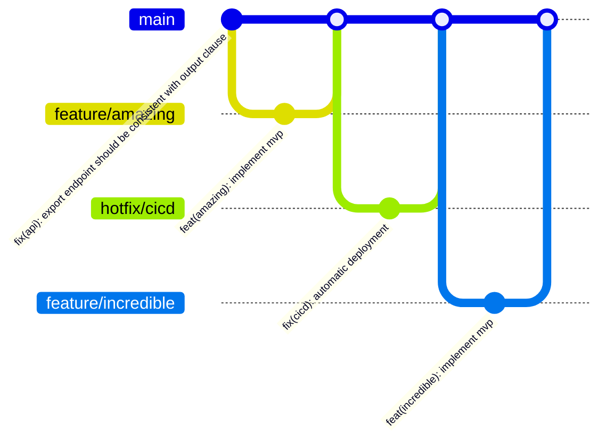

# @nagaozen/template-content

[](https://astro.build/)

## About

`@nagaozen/template-content` is the template for creating documentation sites.

## Features

- Content provided by `mdx`
- Built-in i18n with examples of l10n with fallback
- Built-in search
- Built-in sitemap generation
- Built-in linter
- Open for customization
- Open for extension


## 🚀 Project Structure

This is an  Astro + Starlight + Starlight Topics project, you'll see the following folders and files:

```
.
├── public/
│   └── favicon.png // file extension customizable at `astro.config.mjs`
├── src/
│   ├── assets
│   ├── components
│   │   └── Include.astro // Transclusion component for astro
│   ├── content
│   │   ├── docs
│   │   │   ├── en
│   │   │   │   └── technical
│   │   │   ├── ja // technical missing to test fallback
│   │   │   └── pt-br
│   │   │       └── technical
│   │   ├── i18n
│   │   ├── docs/
│   │   └── config.ts
│   ├── includes // Transclusion sources for mdx
│   ├── pages
│   │   ├── custom.astro // Custom page example (Astro page)
│   │   └── robots.txt.ts // Dynamically create `robots.txt` and `sitemap.xml`
│   ├── styles
│   │   └── custom.css // Custom stylesheet
│   └── env.d.ts
├── astro.config.mjs
├── eslint.config.js
├── package.json
└── tsconfig.json
```

Starlight looks for `.md` or `.mdx` files in the `src/content/docs/:lang/` directory. Each file is exposed as a route based on its file name.

Images can be added to `src/assets/` and embedded in Markdown with a relative link.

Static assets, like favicons, can be placed in the `public/` directory.

## 🧞 Commands

All commands are run from the root of the project, from a terminal:

| Command                   | Action                                           |
|:--------------------------|:-------------------------------------------------|
| `npm install`             | Installs dependencies                            |
| `npm run dev`             | Starts local dev server at `localhost:4321`      |
| `npm run build`           | Build your production site to `./dist/`          |
| `npm run preview`         | Preview your build locally, before deploying     |
| `npm run astro ...`       | Run CLI commands like `astro add`, `astro check` |
| `npm run astro -- --help` | Get help using the Astro CLI                     |

## 👀 Want to learn more?

* [Starlight’s Documentation](https://starlight.astro.build/)
* [Starlight’s Sidebar Topics](https://starlight-sidebar-topics.netlify.app/)
* [Astro documentation](https://docs.astro.build)

## Contributing

We welcome contributions! Contributions are what make the open source community such an amazing place to learn, inspire, and create. Any contributions you make are **greatly appreciated**.

If you have a suggestion that would make this better, please fork the repo, make changes and create a pull request. You can also simply open an issue with the tag "enhancement". Don't forget to give the project a star! Thanks again!

This GitHub repository adheres to the principles of [GitHub Flow](https://docs.github.com/en/get-started/using-github/github-flow) as outlined in the official GitHub documentation. We ensure that all changes are made through branch-based workflows, enabling collaborative development and efficient code review before integration into the main branch.



1. Fork the Project
1. Create your Feature Branch (`git checkout -b feature/amazing`)
1. Commit your Changes (`npm run commit`)
1. Push to the Branch (`git push origin feature/amazing`)
1. Open a Pull Request

# Useful links
* [README logos](https://stock.adobe.com/br/contributor/208853516/hasan?load_type=author) -- logos repository with the same pattern we are using.
* [Simple Icons](https://simpleicons.org/) -- `shields.io` badges icons and colors.